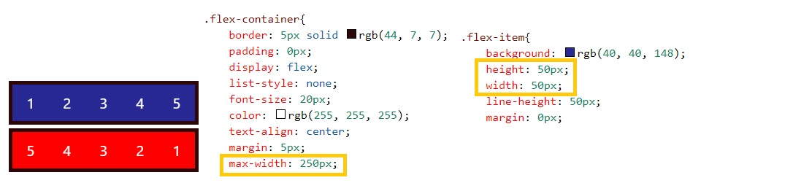
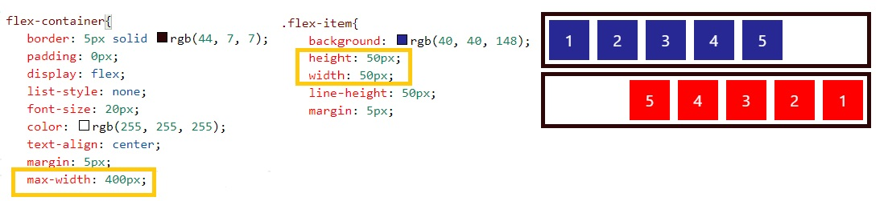
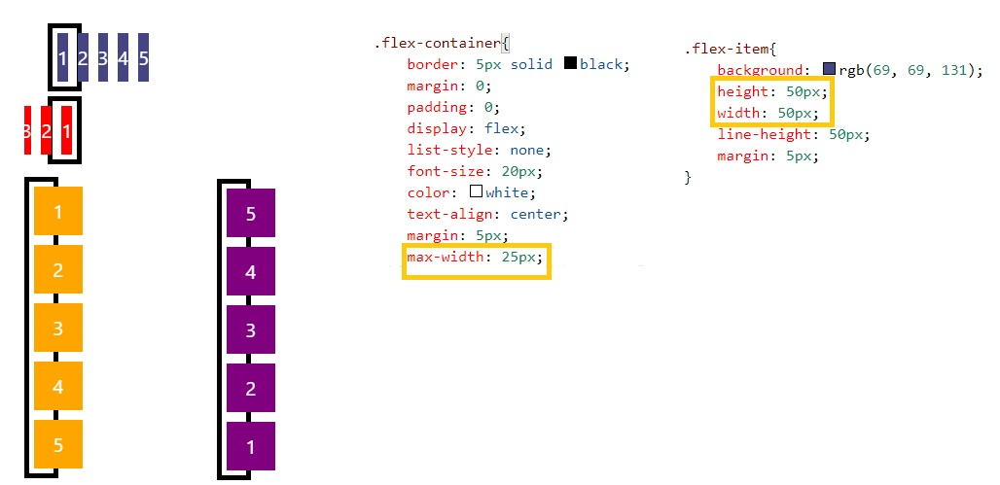

# Acervo
**Sobre** 
Aqui se encontra um compilado de anotações, sobre um determinado assunto ou tecnologia que eu precise dar uma "passadinha de olho" posteriormente, transcrito do meu caderno de anotações para compor este arquivo .md." 
Lembre-se, aqui você não encontrará tudo referente ao assunto em questão, somente anotações pontuais e de relevância para mim em meus estudos.

**Importante** 
*"O índice a seguir mostra o tipo do conteúdo para o qual existe algum tipo de anotação a respeito."*

## **Índice**

**1. Flexbox** 
**1. HTTP e HTTPS** 
**2. Internet** 
**3. PHP**

## 1. Flexbox 

- Raciocínio que me ajudou a compreender melhor o assunto: 
Ao definir definir o tamanho do container você delimita até que ponto os *filhos* deste container irão se distribuir, note que, enquanto o tamanho do container é equivalente a soma do tamanho dos seus items *filhos* ele permace estatico. 

*Obs: imagem azul representa row  e vermelha row-reverse* 
Note que o tamanho do container tem valor de 250px e seus *"filhos"* 50px, deste modo eles continuam na mesma posição só muda a direção, da direita para esquerda. pelo row-reverse presente na estrutura vermelha.
 

Quando o tamanho do container gera uma *"sobra"* ele se organizam conforme o sentido que foi definido. 

O oposto ocorre quando se diminuí o tamanho do container, até o ponto de vazar seus itens.Note que o tamanho do container é a metade do valor dos seus itens *filhos* fica bastante nítido pela distribuição em colunas. (coluna amarela está definida como row e a roxa como row reverse). 

## 2. HTTP e HTTPS 
- É a ponte entre o conteúdo solicitado e o navegador do cliente. 
- O que difere entre HTTPS e HTTP é o fator de segunrança, ao constrír um site com o uso do HTTPS o administrador precisa de duas chaves, a privada fica com o servidor garantindo que as informações sejam acessadas apenas pelo detentor da mesma.

## 3. Internet 
- Diferença entre *link* e *URL*: 
Link é a ligação (ponte p/ outra página). 
URL é o enderço

- Backbone 
Basicamente auxiliam na comunicação dos dados, possuem ligação com outros backbones.

- P2P 
Comunicação entre dois dispositivos sem uso da internet.

- DSN (*Domain Name System*) 
Converte o endereço URL no seu respectivo IP.

- TCP/IP (*Trasnmission Control Protocol*) 
Forma de comunicação composta por 4 camadas.

## 4. PHP 
- Linguagem de programação utilizada no back-end, pode ser embutida no HTML.
- Interpretado, ou seja não gera um executável  o servidor que interpreta  e executa seu conteúdo. 
- Necessário servidor web.

